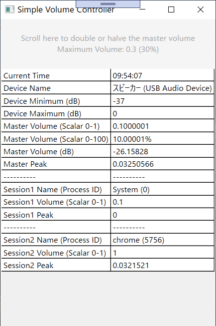

# SimpleVolumeController

This is a small application to quickly lower the master volume.\
Scroll up or down on the specified area to double or halve the volume.\
You can also observe the master and session volume levels, which are updated every second.\
The new volume is saved on Windows, so you can close this application when finished.

I created this app because some apps had been too loud on my computer.\
After working on this hobby project, however, I found that there was a nice session volume control on Windows 10.\
If you would like to lower the volume of a specific application, I recommend using it instead.\
_Settings > System > Sound > App volume and device preferences (as of May 2020)_

The maximum master volume is set to 30% so your computer doesn't make a sound blast :+1:

 

## Findings during the development
The volume level we hear on Windows seems to be calculated by this equation: (Master Volume) * (Session Volume).

You can alter the master volume by clicking the speaker icon on the task bar (0 - 100% in 1% increment).\
To change each session volume, you would use the new audio control (0 - 100% in 1% increment).

Combining these, you can reach the minimum volume level of 0.01% (1% * 1%) by default on Windows 10.\
With SimpleVolumeController, you can dive further than this limit.

 

## Acknowledgement
[NAudio](https://github.com/naudio/NAudio) - For the comprehensive library\
[Degath](https://degathsducker.weebly.com/) - For helpful ideas and advice

Thank you very much!
